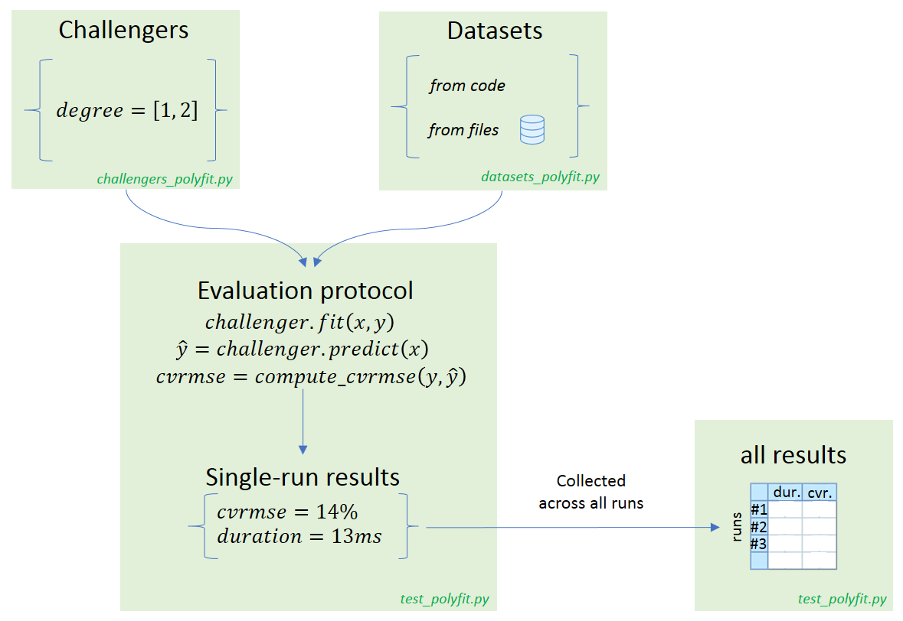

# Data science benchmark example


## Motivation

### a- Research

Most experimental data science papers nowadays include **results tables** at the end of the paper, where typically there is one entry per dataset per configuration to try (parameters). To produce these tables, we collectively spend a significant amount of coding and debugging time that could be devoted to more interesting matters (such as focusing on improving the core algorithms).

### b- Industry

A frequent need for teams industrializing data science software bricks is to be able to **test them against a large quantity of datasets**, in other words to create a *reference benchmark*. Teams might have two objectives in mind:

 - getting an overview of the **performance of a single algorithm** on a large quantity of cases, so as to be sure of its genericity
 - **comparing several algorithms or several configurations**, to see which one is the best overall and on specific cases.


## What is missing today ?

It is obviously quite trivial to start developing a benchmark engine: a couple `for` loops can do the trick. However as soon as one wishes to

 * run each evaluation in an independent context (possibly distributed on several processors/platforms)
 * and for each evaluation, get an independent capability to:
 
     * Log (see what has been done)
     * Debug (understand why it does not work as expected)
     * Profile (understand what takes time to potentially improve speed)

Then one finds out that it is a bit more complex to develop. And by taking a step back we find that `pytest` and its ecosystem (`pytest-profile`, `pytest-logging`, `pytest-xdist`...) **already provide all of this** (plus a nice integration in your IDE) !

## Example description

In this simple example we will benchmark the `np.polyfit` function, that fits polynomial functions. Our benchmark activity is described by three axis of variability: *challengers* (this encompasses both variability in algorithms and parameters), *datasets*, and *evaluation protocol*.

You can download all the python scripts from this example [here](https://github.com/smarie/pytest-patterns/releases/latest).

### a- Challengers

The `polyfit` function has a `degree` parameter allowing to restrict the polynomial order of the function. We will compare two configurations: 

 * degree = 1 (linear regression)
 * degree = 2 (quadratic).

### b- Datasets

We both want to test the algorithm against:

 - datasets generated from python code (in this example we will generate the famous [Anscombe's quartet](https://en.wikipedia.org/wiki/Anscombe%27s_quartet))
 - datasets provided as [csv files](https://github.com/smarie/pytest-patterns/blob/master/pytest_patterns/data_science_benchmark/datasets)

In real world applications it makes sense to use code to **generate edge/challenging cases** while continuing to use data files to represent **"typical" datasets** (real-world data). 

### c- Evaluation protocol

Our evaluation protocol will be very basic:

 - **fit** a model to the data,
 - apply the model to the same dataset to get **predictions**
 - compute **accuracy** using the CV-RMSE metric

### Summary

To sum-up, we would like to execute all experiments described in the following plots (one plot per dataset):


Note: these plots have been generated with the "advanced" data science benchmark [example](./advanced).

## Executing the example

### a- Requirements

The files required to run this example are located in the `data_science_benchmark/` folder, available [here](https://github.com/smarie/pytest-patterns/releases/latest).

To use this code you have to install `pytest`, as well as two dependencies:

 - [pytest-cases](https://smarie.github.io/python-pytest-cases/) to separate test code (the evaluation protocol) from test data (the datasets)
 - [pytest-harvest](https://smarie.github.io/python-pytest-harvest/) to collect applicative results from all runs and create the final synthesis table

```bash
>>> pip install pytest-cases
>>> pip install pytest-harvest
``` 

This example also requires `numpy` (for the `polyfit` method) and `pandas` (for synthesis table creation). 

```bash
>>> [conda/pip] install pandas numpy
```

### b- First run

Go in the example's folder and execute pytest, either from your favorite IDE or using a commandline:

```cmd
>>> pytest data_science_benchmark/ -v
```

You should see 13 test executions:

```
============================= test session starts =============================
...
collected 13 items 

test_polyfit.py::test_poly_fit[polyfit(degree=1)-Anscombe's quartet 1] PASSED
test_polyfit.py::test_poly_fit[polyfit(degree=2)-Anscombe's quartet 1] PASSED
test_polyfit.py::test_poly_fit[polyfit(degree=1)-Anscombe's quartet 2] PASSED
test_polyfit.py::test_poly_fit[polyfit(degree=2)-Anscombe's quartet 2] PASSED
test_polyfit.py::test_poly_fit[polyfit(degree=1)-Anscombe's quartet 3] PASSED
test_polyfit.py::test_poly_fit[polyfit(degree=2)-Anscombe's quartet 3] PASSED
test_polyfit.py::test_poly_fit[polyfit(degree=1)-Anscombe's quartet 4] PASSED
test_polyfit.py::test_poly_fit[polyfit(degree=2)-Anscombe's quartet 4] PASSED
test_polyfit.py::test_poly_fit[polyfit(degree=1)-Data file 'contant-1.csv'] PASSED
test_polyfit.py::test_poly_fit[polyfit(degree=2)-Data file 'contant-1.csv'] PASSED
test_polyfit.py::test_poly_fit[polyfit(degree=1)-Data file 'v-shape.csv'] PASSED
test_polyfit.py::test_poly_fit[polyfit(degree=2)-Data file 'v-shape.csv'] PASSED
test_polyfit.py::test_synthesis PASSED

========================== 13 passed in 0.67 seconds ==========================
```

You should also see a new file created: `polyfit_bench_results.csv`. This file contains the benchmark results table.

### c- Optional: summary plot

If you install `matplotlib`, you will also see some synthesis plots:


Note that the tests will end when you close the figure. See [matplotlib documentation](https://matplotlib.org/) for details.

### d- Optional: tabulate

If you install `tabulate` and enable the `-s` flag you will be able to see the table nicely printed in your console too:

```cmd
>>> pip install tabulate
>>> pytest data_science_benchmark/ -v -s
``` 

### e- Optional: pytest filtering

Since pytest is the engine used behind the scenes, there are a number of things you can do directly. For example you can run only a subset of all cases by using your IDE integration, or by using [pytest commandline filters or markers](https://docs.pytest.org/en/latest/usage.html#specifying-tests-selecting-tests). For example

```bash
>>> pytest data_science_benchmark/ -v -k "test_poly_fit[polyfit(degree=2)-Ansc"
```

Will only run the 4 following cases:

```bash
============================= test session starts =============================
...
collected 13 items 

test_polyfit.py::test_poly_fit[polyfit(degree=2)-Anscombe's quartet 1] PASSED
test_polyfit.py::test_poly_fit[polyfit(degree=2)-Anscombe's quartet 2] PASSED
test_polyfit.py::test_poly_fit[polyfit(degree=2)-Anscombe's quartet 3] PASSED
test_polyfit.py::test_poly_fit[polyfit(degree=2)-Anscombe's quartet 4] PASSED

===== 9 tests deselected by '-ktest_poly_fit[polyfit(degree=2)-Anscombe' ======
=================== 4 passed, 9 deselected in 0.66 seconds ====================
```

This might be particularly interesting to debug particular cases, or to perform *profiling* on only a subset (see below).

### f- Optional: pytest profiling

Since pytest is the engine used behind the scenes, there are a number of plugins available! This one is a good example. Simply install `pytest-profiling` and execute the benchmark with the `--profile-svg` flag. Here we use a filter to focus on the "evaluation" nodes and skip the synthesis code that is less interesting to profile.

```bash
>>> pytest data_science_benchmark/ -v -k "test_poly_fit" --profile-svg
```

The extract of the generated `prof/combined.svg` file below shows that this can be a great help to understand where the challengers take time.


Here 53% of the total python execution time is spent inside the evaluation protocol `test_poly_fit`. The rest of the time is probably spent in pytest setup and teardown (including setup and teardown of our challenger and dataset fixtures). These 53% can be decomposed in 

 - 34% for the fit method
 - 5% for the predict method
 - 2.81% for the cvrmse calculation, where most time is spent in the `np.mean` method (called twice per run).


Note that `pytest-profiling` requires `graphviz` to be installed on your machine. You can install it using `conda install` if your python distribution is anaconda.

!!! note "Windows + anaconda users"
    If you are in this configuration, you might find that the svg file is not generated even though no particular error is encountered. This is a known bug in pytest-profiling with already a proposed [solution](https://github.com/manahl/pytest-plugins/pull/99). Until they integrate the fix, you may wish to clone the proposed Pull Request branch on your local environment.
    
!!! note "Pycharm + anaconda users"
    If you are in this configuration and installed graphviz using conda, PyCharm might forget to add it to the system PATH. You have to do it manually. This is a known issue in [PyCharm](https://youtrack.jetbrains.com/issue/PY-32408).
    
### g- Optional: pytest logging

**TODO** explain how to use `pytest-logger` to generate one log file per test node.

## Code details

Our solution is made of three files:

 - `test_polyfit.py` contains the benchmark logic: the evaluation protocol and the synthesis table creation
 - `challengers_polyfit.py` contains the code to create the challengers: the two variants of `np.polyfit` with degree=1 and degree=2
 - `datasets_polyfit.py` contains the code to generate or parse (from csv files) the benchmark datasets




### a- Evaluation protocol

The first thing to do when creating a benchmark is to create the function that will evaluate each node (i.e. that will correspond to a single row in the results table). For this we create a pytest test function, that is, a function whose name starts with `test_`. *Note: the file name should also start with `test_`, that's a requirement from pytest.*

```python
def test_poly_fit(challenger, dataset, results_bag):
    # Get the test case at hand
    x, y = dataset

    # Fit the model
    challenger.fit(x, y)

    # Use the model to perform predictions
    predictions = challenger.predict(x)

    # Evaluate the prediction error
    cvrmse = np.sqrt(np.mean((predictions-y)**2)) / np.mean(y)
    results_bag.cvrmse = cvrmse
```

Now we need to tell pytest how to generate the three inputs:

 - we need to collect and inject the `challenger` objects, that should implement both a `fit` and `predict` method
 - we need to collect and inject the `dataset` objects, that should be tuples `(x, y)`
 - we need to collect and inject the `results_bag` objects, where we store our cv-rmse metric.

We will perform all of this by relying on the same mechanism: `pytest` "fixtures". However that would require a significant amount of code so we rely on plugins to help us on the way. 


### b- Challengers

We create a `challenger` fixture, with a single parameter containing the degree to use in `np.polyfit`:

```python
@pytest.fixture(params=[1, 2], ids="polyfit(degree={})".format)
def challenger(request):
    return PolyFitChallenger(degree=request.param)
```

In order to separate the challenger implementation code from the evaluation protocol, our `PolyFitChallenger` class is located in `challengers_polyfit.py`. It is made of two classes:

 - **Interface** - `BenchmarkChallenger` is the interface that all challengers should implement to enter the benchmark. Here we define that challengers should implement two methods : `fit` and `predict`.
 
```python
class BenchmarkChallenger(object):
    def fit(self, x, y):
        pass

    def predict(self, x):
        pass
```

 - **Implementation** - `PolyFitChallenger` is the class representing a `np.polyfit`-based challenger. This class provides a concrete implementation of `fit` and `predict`, based on numpy. It has one remaining parameter in the constructor: `degree`.

```python
class PolyFitChallenger(BenchmarkChallenger):
    def __init__(self, degree):
        self.degree = degree
       
    # ... (implementation of `fit` and `predict`)
```

### c- Datasets

We create a `dataset` fixture by leveraging `@cases_fixture` (from `pytest_cases`). This decorator allow us to easily parametrize a fixture from a variety of case functions located in a separate module.

```python
@cases_fixture(module=datasets_polyfit, scope='session')
def dataset(case_data):
    return case_data.get()
```

All the code in charge to create the datasets is therefore located in the separate `datasets_polyfit.py` file. There are two main *case functions*:

 - one to generate data **from code**. This function creates the 4 datasets known as Anscombe's quartet.
 
```python
@cases_generator("Anscombe's quartet {i}", i=range(1, 5))
def case_anscombe(i):
    if i == 1:
        x = [10.0, 8.0, 13.0, 9.0, 11.0, 14.0, 6.0, 4.0, 12.0, 7.0, 5.0]
        y = [8.04, 6.95, 7.58, 8.81, 8.33, 9.96, 7.24, 4.26, 10.84, 4.82, 5.68]
    elif i == 2:
        x = [10.0, 8.0, 13.0, 9.0, 11.0, 14.0, 6.0, 4.0, 12.0, 7.0, 5.0]
        y = [9.14, 8.14, 8.74, 8.77, 9.26, 8.10, 6.13, 3.10, 9.13, 7.26, 4.74]
    ...

    return x, y
```
 
 - and another **from csv files** located in the `datasets/` folder.

```python
ALL_DATASET_FILES = [(DATASETS_DIR, file_name) 
                     for file_name in listdir(DATASETS_DIR)]

@cases_generator("Datafile '{csv_file_path[1]}'", csv_file_path=ALL_DATASET_FILES)
def case_file(csv_file_path):
    my_data = np.genfromtxt(path.join(*csv_file_path), delimiter=',', names=True)
    return my_data['x'], my_data['y']
```

See [pytest-cases documentation](https://smarie.github.io/python-pytest-cases/) for details.


### d- Results bag

The `results_bag` fixture is created according to [pytest_harvest documentation](https://smarie.github.io/python-pytest-harvest/).


### e- Synthesis table creation

If we run pytest at this stage, all combinations of `challenger`s and `dataset`s would be evaluated, and the `results_bag` of each execution would be stored in the global `store` fixture. To retrieve all results and create the final table we create an additional test that will require this `store` fixture and merge its contents with the contents available from pytest `session`: 

```python
def test_synthesis(request, store):
    # Get session synthesis
    results_dct = get_session_synthesis_dct(request.session, 
                                            filter=test_poly_fit,
                                            durations_in_ms=True,
                                            test_id_format='function', 
                                            status_details=False,
                                            fixture_store=store, 
                                            flatten=True, 
                                            flatten_more='results_bag')

    # convert to a pandas dataframe
    results_df = pd.DataFrame.from_dict(results_dct, orient='index')
    
    ...
```

Note that according to [pytest_harvest documentation](https://smarie.github.io/python-pytest-harvest/) there are many alternate places where you could put this code. I personally like it in a test, because it appears in the IDE pytest tree - but that is not a mandatory feature :) Our only true requirement here is that is runs after all the `test_poly_fit[...]` test nodes.


### f- Summary

To sum-up, the code architecture looks like this:


