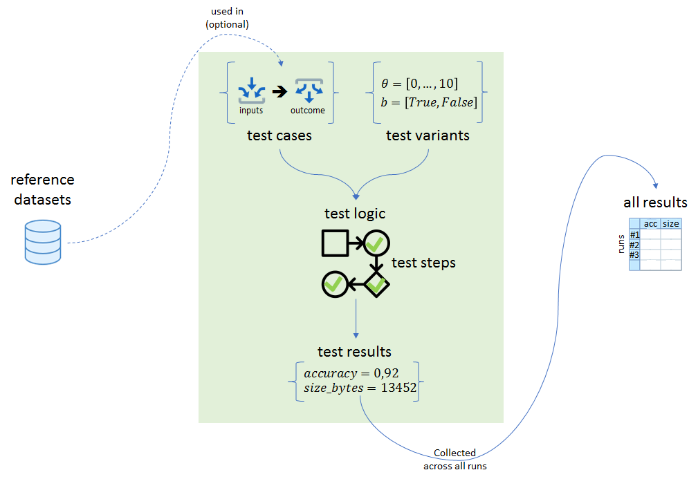

# pytest-patterns

[](https://travis-ci.org/smarie/pytest-patterns) [](https://smarie.github.io/pytest-patterns/junit/report.html) [](https://codecov.io/gh/smarie/pytest-patterns) [](https://smarie.github.io/pytest-patterns/)

A couple of lightweight tools using core `pytest` mechanisms (no hooks nor hacks), so that your tests are easy to write and straightforward to read. In other words:
 
    "pytest for humans ;)"

`pytest` is great but it is extremely generic: thanks to its core `fixture` and `parametrize` concepts, the possibilities are almost infinite! The purpose of this project is to provide a few of these possibilities hardcoded with intuitive names and parameters, so that you do not need to spend hours designing your tests when your needs fall into "classical needs". 



Currently there are patterns to:

 - **separate test code from test data** (for example inputs, expected outputs, expected errors)
 - **quickly describe test variants**
 - **decompose a test into incremental steps** while sharing results across the steps
 - **collect applicative results from all runs** so as to do some benchmarking


## Installing

```bash
> pip install pytest_patterns
```

## Usage

### Separate test logic from test cases

Decorate your test logic with `@cases_data`. Simply follow the tutorial in [pytest-cases](https://smarie.github.io/python-pytest-cases/).

### Quickly describe test variants

**TODO**

### Decompose a test into incremental steps

Decorate your test logic with `@test_steps`. Simply follow the tutorial in [pytest-steps](https://smarie.github.io/python-pytest-steps/)

### Collect results from all test runs

**TODO**


## See Also

 - [pytest documentation on parametrize](https://docs.pytest.org/en/latest/parametrize.html)
 - [pytest documentation on fixtures](https://docs.pytest.org/en/latest/fixture.html)


### Others

*Do you like this library ? You might also like [my other python libraries](https://github.com/smarie/OVERVIEW#python)* 

## Want to contribute ?

Details on the github page: [https://github.com/smarie/pytest-patterns](https://github.com/smarie/pytest-patterns)
